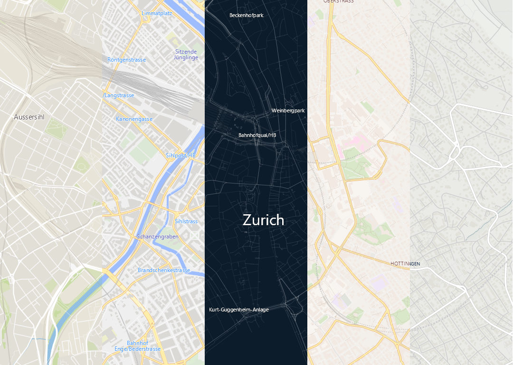
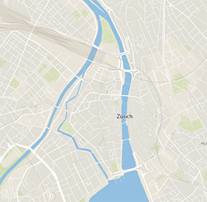
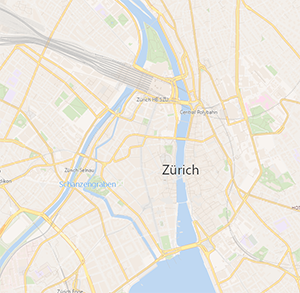
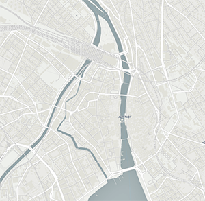
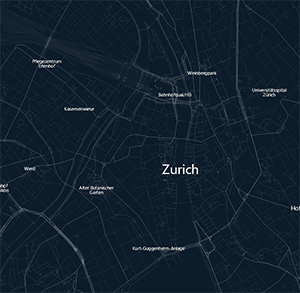
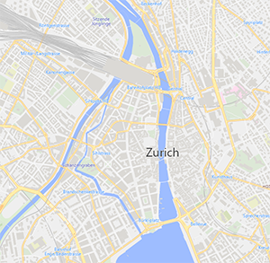
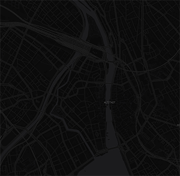
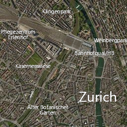
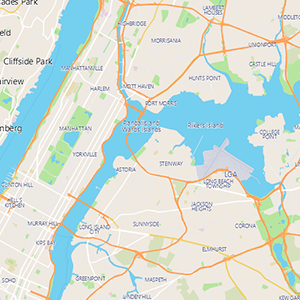
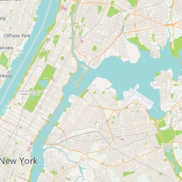

# VectorTileRenderer

## A comprehensive Vector Map Tile Renderer for .Net/C#

<p align="center">
  
</p>

Complete vector tile map rendering solution built in C# for .Net projects. 

## Features

The library is packed with almost all the components for building a successful map application:

- Ready to play demos included for GMap .Net, Mapsui, and static maps
- Comes with 7 styles: Basic, Bright, OSM Liberty, Dark, Runner, Street, and Hybrid.
- Vector tiles can be loaded from MbTiles database, or Pbf (protocol buffer) file
- Automatic unzipping of gzipped pbf tiles
- Support and demos for WPF and WinForms (UWP and .Net core is planned)
- Support for basic satellite and hybrid satellite raster tiles
- Plug and play support for multiple rendering engines.
- Compatable with [mapbox/openmaptiles vector tile specification](https://www.mapbox.com/vector-tiles/specification/)
- Supports [mapbox style specification](https://www.mapbox.com/mapbox-gl-js/style-spec/)
- Stress free MIT License

  


## So what is a vector map tile?

The maps that we see in online and offline applications are composed of blocks of square tiles. Each tile is an image, and the map is basically a grid of these images. In traditional apps, these images were in PNG/JPEG format, and are fetched from the server and displayed on the client.

Vector Tiles are a relatively newer concept. They operate almost like an SVG image. The server instead of sending full PNG/JPEG image tiles, it just sends vector data which is composed of paths, polygons, points, and text. That vector data is rendered on the client side. That way, a developer can choose how he wants to display a map. Devs can color the roads blue, and the sea as teal; they can hide certain features of a map; or they can manipulate the map their own way. Vector tiles have the following advantages:

- They have a small size, and can save a lot of bandwidth.
- They are highly customizable in every aspect.
- They can be scaled up from 1x to ∞ without losing quality.
- They can be safely base rendered at 256x256, 512x512, or 1024x1024 sizes.
- They are ideal for offline maps.
- They can be used for geocoding and reverse geocoding.

## Basic Example

### Loading a tile from .pbf file:

```C#
// load style and fonts
var style = new VectorTileRenderer.Style("basic-style.json");
style.FontFallbackDirectory = "styles/fonts/";

// set pbf as tile provider
var provider = new VectorTileRenderer.Sources.PbfTileSource("tile.pbf");
style.SetSourceProvider(0, provider);

// render it on a skia canvas
var zoom = 13;
var canvas = new SkiaCanvas();
var bitmap = await Renderer.Render(style, canvas, 0, 0, zoom, 512, 512, 1);

imageView.Source = bitmap;
```

### Loading a tile from .mbtiles file:

```C#
// load style and fonts
var style = new VectorTileRenderer.Style("bright-style.json");
style.FontFallbackDirectory = "styles/fonts/";

// set mbtiles as tile provider
var provider = new VectorTileRenderer.Sources.MbTilesSource("zurich.mbtiles");
style.SetSourceProvider(0, provider);

var zoom = 13;
var x = 1439;
var y = 1227;

// render it on a skia canvas
var canvas = new SkiaCanvas();
var bitmap = await Renderer.Render(style, canvas, x, y, zoom, 512, 512, 1);

imageView.Source = bitmap;
```

   

### Merging vector and raster for hybrid satellite view:

```C#
// load style and fonts
var style = new VectorTileRenderer.Style("hybrid-style.json");
style.FontFallbackDirectory = "styles/fonts/";

// add vector tile
var vectorProvider = new VectorTileRenderer.Sources.PbfTileSource(@"tiles/zurich.pbf.gz");
style.SetSourceProvider(0, vectorProvider);

// add raster satellite tile
var rasterProvider = new VectorTileRenderer.Sources.RasterTileSource(@"tiles/zurich.jpg");
style.SetSourceProvider("satellite", rasterProvider);

// render it on a skia canvas
var zoom = 14;
var canvas = new SkiaCanvas();
var bitmap = await Renderer.Render(style, canvas, 0, 0, zoom, 256, 256, 1);

imageView.Source = bitmap;
```

 

## Vector Map in Mapsui and GMap .Net

The repository contains demos for showing vector tiles on both Mapsui and Gmap .Net. The integration code is pretty basic and should be easy to modify if needed.

### Using vector mbtiles data in Mapsui

```C#
// load the source
var source = new VectorMbTilesSource(@"tiles/zurich.mbtiles", @"styles/basic-style.json", @"tile-cache/");

// attach it to the map
MyMapControl.Map.Layers.Clear();
MyMapControl.Map.Layers.Add(new TileLayer(source));
MyMapControl.Map.ViewChanged(true);
```

### Using vector mbtiles data in GMap .Net

```C#
// load the source
var provider = new VectorMbTilesProvider(@"tiles/zurich.mbtiles", @"styles/basic-style.json", @"tile-cache/");

// attach it to the map
gmap.MapProvider = provider;
```

## Using Mapbox tiles and styles

In terms of format and specifications, the mapbox tiles and styles are similar to openmaptiles tiles and styles. But they are different in terms of the naming convention and terminologies, which makes them incompatable for mix and match. For mapbox tiles, only the mapbox styles would work.

The VectorTileRender has support for both mapbox and openmaptiles. But a compatable style has to be used for rendering.

 

## Known issues

The entire project including the demos, integrations, and optimization techniques was developed by myself in 4 days. I can't call this production ready yet, but I couldn't encounter any significant issues while testing the demos, except for these:

- At some places, the text might be cut off at tile edges.
- The text on lines/roads is intentionally disabled due to rendering issues with SkiaSharp.
- There's no mechanism for purging old cache in tiles-cache directory, yet.
- It uses SkiaSharp for rendering which is mostly done on CPU, so the tile loading might show some lag.

## GPU powered vector map drawing

Currently the rendering is done using SkiaSharp, which is sort of GPU powered. The eventual goal is to replace SkiaSharp with some hardware accelerated rendering system that offloads the major processing away from CPU. Possible candidates are OpenTK, SharpDX, SharpGL, and SkiaSharp with ANGLE. Therefore this project actively needs some contribution support from the community.

## Contribution

The project has some potential since it is probably the only open-source vector tile rendering system for Windows. Therefore, it actively needs some good contribution support. Bug reports, suggestions and pull requests are all welcome. Please submit them to the [GitHub issue tracker](https://github.com/AliFlux/VectorTileRenderer/issues).

## Stay In Touch

For latest releases and announcements, check out my site: [aliashraf.net](http://aliashraf.net)

## License

This software is released under the [MIT License](LICENSE). Please read LICENSE for information on the
software availability and distribution.

Copyright (c) 2018 [Ali Ashraf](http://aliashraf.net)